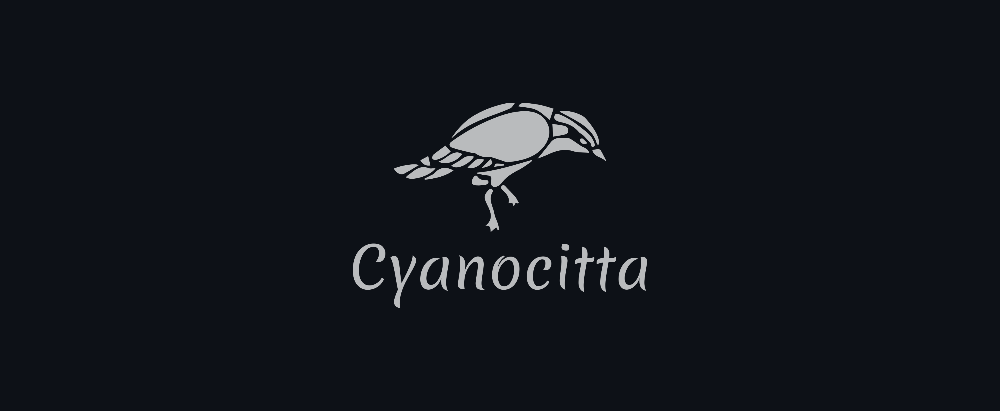

## About
A [Nostr](https://github.com/nostr-protocol/nostr) client built with [Rust](https://www.rust-lang.org/) + [Tauri](https://tauri.app/) for Windows, Linux, Android and iOS.

## Installing
You can find compiled binaries for all major platforms [here](https://github.com/jonassterud/cyanocitta/releases).

## Contributing
Feel free to contribute!

Use tools such as [Rustfmt](https://github.com/rust-lang/rustfmt) and [Clippy](https://github.com/rust-lang/rust-clippy) to improve your code.  
Commit messages should follow [conventionalcommits.org](https://www.conventionalcommits.org).  
Where type is one of the following: `feat`, `fix`, `ci`, `docs` or `refactor`.

## License
This project is licensed under the MIT License - see the [LICENSE](./LICENSE) for details.
